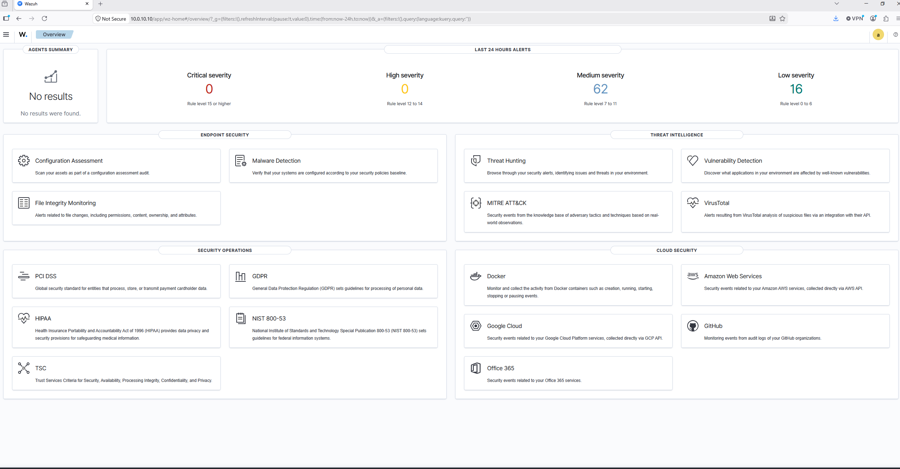
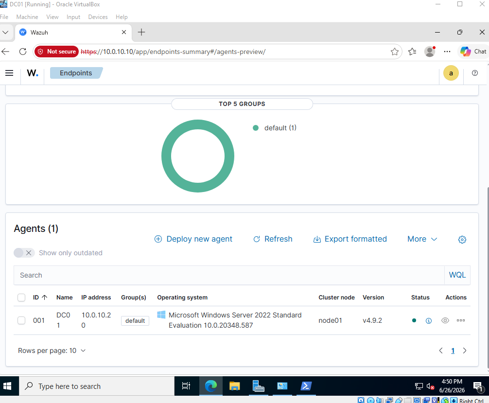
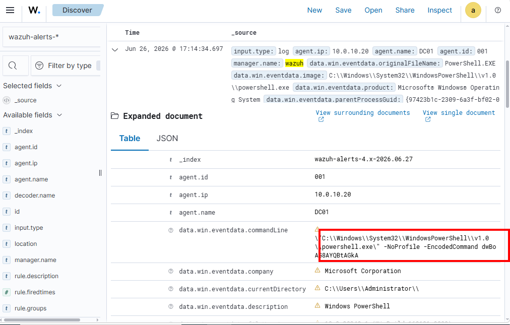
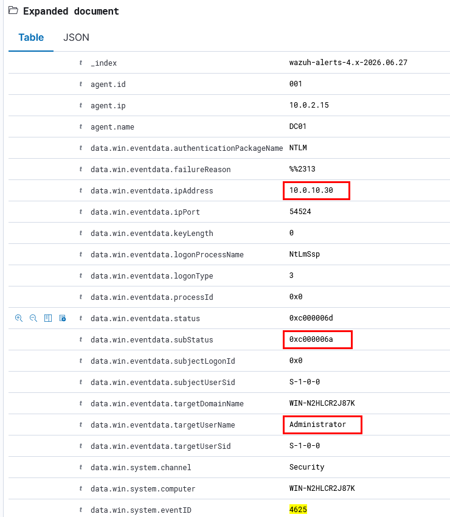

# Home SOC & Detection Range

> An isolated, hands-on Security Operations Center built from scratch. Attacks are emulated against a **Sysmon-instrumented Windows endpoint**, telemetry flows into a **Wazuh SIEM**, and every attack is taken full-circle — **detection → investigation → MITRE ATT&CK mapping**. Built to practice the day-to-day work of a SOC analyst / junior detection engineer, and documented so the work is visible without logging in.


---

## <a id="whats-built-today"></a>What's built today vs. planned

I designed the full dual-SIEM range up front, then build it in vertical slices. Here's the honest current state:

| Component | Status |
|---|---|
| Isolated host-only lab network (`10.0.10.0/24`, no internet route) | ✅ Built |
| **Wazuh 4.9 SIEM** (manager + indexer + dashboard) | ✅ Built |
| **Windows Server 2022 endpoint** — Sysmon (tuned config) + Wazuh agent | ✅ Built |
| **Kali attacker** on the lab network | ✅ Built |
| **T1059.001 Encoded PowerShell** — detected, investigated end-to-end | ✅ Verified |
| **T1110 Brute Force** — network attack from Kali, failed-logon burst detected | ✅ Verified |


---

## See it working

From the SIEM, to a monitored endpoint, to live detections — each image below is the lab actually running.

**1. The Wazuh SIEM monitoring the lab**



**2. A Windows endpoint reporting in — Sysmon + Wazuh agent**



**3. Detection — encoded PowerShell (T1059.001)** · the base64 `-EncodedCommand` payload is captured and ready to be decoded.



**4. Detection — brute force from Kali (T1110)** · a burst of failed logons (Event 4625); the `subStatus` field reveals valid-username / wrong-password




---

## The core loop

```
emulate attack  →  endpoint telemetry (Sysmon / Windows Security)
       →  forwarded by the Wazuh agent  →  detection rule fires
       →  analyst triages  →  investigates (timeline, IOCs, scope)
       →  writes incident report 
```


---

## Detections verified

| Technique | ATT&CK | Tactic | How it was caught | Writeup |
|---|---|---|---|---|
| Encoded PowerShell | [T1059.001](https://attack.mitre.org/techniques/T1059/001/) | Execution | Sysmon EID 1 → Wazuh rule (base64 `-EncodedCommand`) | [incident-001](investigations/incident-001-encoded-powershell.md) |
| Brute force | [T1110](https://attack.mitre.org/techniques/T1110/) | Credential Access | `netexec` SMB from Kali → Windows 4625 burst in the SIEM | [incident-002](investigations/incident-002-brute-force.md) |


---


## Safety & ethics

Everything here is **benign adversary *emulation* against my own isolated lab VMs** to generate detection telemetry — on a host-only network with no route to the internet or any third party. Nothing here is weaponized or aimed at any system I don't own.

---

